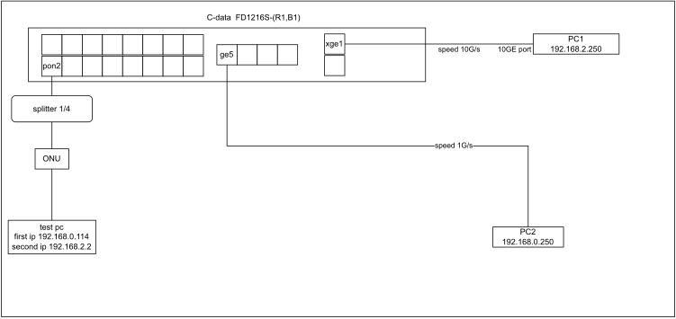

# Обновление

Описанная ниже ошибка была исправлена в обновлении прошивки от 20.09.2023 года

Ниже ссылки на загрузку исправленных прошивок

- [FD1216S-R1](firmware/FD1216S_Image_V1.6.0_230920_10997_X000.img)
- [FD1208S-R1](firmware/FD1208S_Image_V1.6.0_230920_10997_X000.img)
- [FD1216S-B1](firmware/FD1216S_B0_Image_V1.6.0_230920_10997_X000.img)

# Описание ошибки в оборудовании C-DATA FD1216S

На всех OLT серии FD1216S включая версии R1, B1 и на всех доступных нам прошивках проявляется потеря пакетов при передачи трафика из 10GE порта в PON порт. Причем потери достигают 60% от всего трафика.

Потери проявляются как низкая скорость у клиента если OLT подключено портом "uplink" через 10GE порт

Ошибка проявляется для трафика идущего в торону ONU

Для воспроизведения этой ошибки достаточно собрать стенд представленный на рисунке ниже

Настройки OLT - заводские, т.е. никаких настроек не производится (ошибка проявляется при любых настройках)

### Описание схемы. 

#### PC1

подключен оптическим патчкордом в порт XGE1

имеет 10GE оптический интерфейс

имеет ip адрес 192.168.2.200/24

#### PC2

подключен медным патчкордом в порт ge5.

имеет адрес 192.168.0.250/24

#### test PC

Имеет 2 ip адреса 192.168.0.114/24 и 192.168.2.2/24

### Запуск тестов

После включения схемы запускаем на тестовом компьютере iperf3 как сервер

	iperf3 -s
	
Сначала запускаем тест на PC2

Получим следующий результат

	iperf3 -c 192.168.0.114
	Connecting to host 192.168.0.114, port 5201
	[  5] local 192.168.0.250 port 50172 connected to 192.168.0.114 port 5201
	[ ID] Interval           Transfer     Bitrate         Retr  Cwnd
	[  5]   0.00-1.00   sec   122 MBytes  1.03 Gbits/sec    0    443 KBytes
	[  5]   1.00-2.00   sec   112 MBytes   944 Mbits/sec    0    443 KBytes
	[  5]   2.00-3.00   sec   112 MBytes   944 Mbits/sec    0    443 KBytes
	[  5]   3.00-4.00   sec   111 MBytes   933 Mbits/sec    0    492 KBytes
	[  5]   4.00-5.00   sec   112 MBytes   944 Mbits/sec    0    513 KBytes
	[  5]   5.00-6.00   sec   112 MBytes   944 Mbits/sec    0    566 KBytes
	[  5]   6.00-7.00   sec   112 MBytes   944 Mbits/sec    0    592 KBytes
	[  5]   7.00-8.00   sec   111 MBytes   933 Mbits/sec    0    592 KBytes
	[  5]   8.00-9.00   sec   112 MBytes   944 Mbits/sec    0    592 KBytes
	[  5]   9.00-10.00  sec   112 MBytes   944 Mbits/sec    0    653 KBytes
	- - - - - - - - - - - - - - - - - - - - - - - - -
	[ ID] Interval           Transfer     Bitrate         Retr
	[  5]   0.00-10.00  sec  1.11 GBytes   950 Mbits/sec 0             sender
	[  5]   0.00-10.00  sec  1.10 GBytes   941 Mbits/sec                  receiver
	
	iperf Done.
Как можно видеть скорость потока в сторону test PC достигает почти 1G

теперь запускаем тест на PC1

	iperf3 -c 192.168.2.2
	Connecting to host 192.168.2.2, port 5201
	[  5] local 192.168.2.250 port 46558 connected to 192.168.2.2 port 5201
	[ ID] Interval           Transfer     Bitrate         Retr  Cwnd
	[  5]   0.00-1.00   sec  46.2 MBytes   388 Mbits/sec  541   36.8 KBytes
	[  5]   1.00-2.00   sec  33.8 MBytes   283 Mbits/sec  513   31.1 KBytes
	[  5]   2.00-3.00   sec  35.0 MBytes   294 Mbits/sec  584   55.1 KBytes
	[  5]   3.00-4.00   sec  33.8 MBytes   283 Mbits/sec  540   35.4 KBytes
	[  5]   4.00-5.00   sec  35.0 MBytes   294 Mbits/sec  538   29.7 KBytes
	[  5]   5.00-6.00   sec  33.8 MBytes   283 Mbits/sec  515   58.0 KBytes
	[  5]   6.00-7.00   sec  35.0 MBytes   294 Mbits/sec  590   35.4 KBytes
	[  5]   7.00-8.00   sec  33.8 MBytes   283 Mbits/sec  542   58.0 KBytes
	[  5]   8.00-9.00   sec  35.0 MBytes   294 Mbits/sec  616   35.4 KBytes
	[  5]   9.00-10.00  sec  35.0 MBytes   294 Mbits/sec  517   32.5 KBytes
	- - - - - - - - - - - - - - - - - - - - - - - - -
	[ ID] Interval           Transfer     Bitrate         Retr
	[  5]   0.00-10.00  sec   356 MBytes   299 Mbits/sec 5496             sender
	[  5]   0.00-10.00  sec   345 MBytes   289 Mbits/sec                  receiver

	iperf Done. 

Как можно видеть если источник трафика имеет 10G порт и подключен к OLT 10G портом, то наблюдаются большие потери.

Эти потери можно увидеть как discard packet на порту OLT epon2

### Вывод

В OLT АFD1216S присутствует ошибка при передаче пакетов из 10G порта в 1G EPON порт.

# Update

The error described below was fixed in the firmware update from 09/20/2023

Below are links to download fixed firmware

- [FD1216S-R1](firmware/FD1216S_Image_V1.6.0_230920_10997_X000.img)
- [FD1208S-R1](firmware/FD1208S_Image_V1.6.0_230920_10997_X000.img)
- [FD1216S-B1](firmware/FD1216S_B0_Image_V1.6.0_230920_10997_X000.img)

# Description of the error in the C-DATA FD1216S hardware

On all FD1216S OLT series, including versions R1, B1 and on all firmware available to us, packet loss is manifested when transmitting traffic from the 10GE port to the PON port. Moreover, losses reach 60% of all traffic.

Losses are manifested as low speed for the client if the OLT is connected by the "uplink" port via the 10GE port

The error appears for traffic going to the ONU toron

To reproduce this error, it is enough to assemble the stand shown in the figure below

OLT settings are factory settings, i.e. no settings are made (the error appears at any settings)

### Description of the scheme. 

#### PC1

connected by an optical patch cord to the XGE1 port

It has a 10GE optical interface

has an ip address of 192.168.2.200/24

#### PC2

connected by a copper patch cord to the ge5 port.

has the address 192.168.0.250/24

#### test PC

It has 2 ip addresses 192.168.0.114/24 and 192.168.2.2/24

### Running tests

After enabling the scheme, we run iperf3 on the test computer as a server

	iperf3 -s
	
First we run the test on PC2

We get the following result

	iperf3 -c 192.168.0.114
	Connecting to host 192.168.0.114, port 5201
	[  5] local 192.168.0.250 port 50172 connected to 192.168.0.114 port 5201
	[ ID] Interval           Transfer     Bitrate         Retr  Cwnd
	[  5]   0.00-1.00   sec   122 MBytes  1.03 Gbits/sec    0    443 KBytes
	[  5]   1.00-2.00   sec   112 MBytes   944 Mbits/sec    0    443 KBytes
	[  5]   2.00-3.00   sec   112 MBytes   944 Mbits/sec    0    443 KBytes
	[  5]   3.00-4.00   sec   111 MBytes   933 Mbits/sec    0    492 KBytes
	[  5]   4.00-5.00   sec   112 MBytes   944 Mbits/sec    0    513 KBytes
	[  5]   5.00-6.00   sec   112 MBytes   944 Mbits/sec    0    566 KBytes
	[  5]   6.00-7.00   sec   112 MBytes   944 Mbits/sec    0    592 KBytes
	[  5]   7.00-8.00   sec   111 MBytes   933 Mbits/sec    0    592 KBytes
	[  5]   8.00-9.00   sec   112 MBytes   944 Mbits/sec    0    592 KBytes
	[  5]   9.00-10.00  sec   112 MBytes   944 Mbits/sec    0    653 KBytes
	- - - - - - - - - - - - - - - - - - - - - - - - -
	[ ID] Interval           Transfer     Bitrate         Retr
	[  5]   0.00-10.00  sec  1.11 GBytes   950 Mbits/sec 0             sender
	[  5]   0.00-10.00  sec  1.10 GBytes   941 Mbits/sec                  receiver
	
	iperf Done.

As you can see the flow rate towards the test PC reaches almost 1G

now we run the test on PC1

	iperf3 -c 192.168.2.2
	Connecting to host 192.168.2.2, port 5201
	[  5] local 192.168.2.250 port 46558 connected to 192.168.2.2 port 5201
	[ ID] Interval           Transfer     Bitrate         Retr  Cwnd
	[  5]   0.00-1.00   sec  46.2 MBytes   388 Mbits/sec  541   36.8 KBytes
	[  5]   1.00-2.00   sec  33.8 MBytes   283 Mbits/sec  513   31.1 KBytes
	[  5]   2.00-3.00   sec  35.0 MBytes   294 Mbits/sec  584   55.1 KBytes
	[  5]   3.00-4.00   sec  33.8 MBytes   283 Mbits/sec  540   35.4 KBytes
	[  5]   4.00-5.00   sec  35.0 MBytes   294 Mbits/sec  538   29.7 KBytes
	[  5]   5.00-6.00   sec  33.8 MBytes   283 Mbits/sec  515   58.0 KBytes
	[  5]   6.00-7.00   sec  35.0 MBytes   294 Mbits/sec  590   35.4 KBytes
	[  5]   7.00-8.00   sec  33.8 MBytes   283 Mbits/sec  542   58.0 KBytes
	[  5]   8.00-9.00   sec  35.0 MBytes   294 Mbits/sec  616   35.4 KBytes
	[  5]   9.00-10.00  sec  35.0 MBytes   294 Mbits/sec  517   32.5 KBytes
	- - - - - - - - - - - - - - - - - - - - - - - - -
	[ ID] Interval           Transfer     Bitrate         Retr
	[  5]   0.00-10.00  sec   356 MBytes   299 Mbits/sec 5496             sender
	[  5]   0.00-10.00  sec   345 MBytes   289 Mbits/sec                  receiver

	iperf Done. 

As you can see, if the traffic source has a 10G port and is connected to the OLT by a 10G port, then large losses are observed.

These losses can be seen as a discard packet on the OLT epon2 port

### Output

In OLT AFD1216S there is an error when transferring packets from the 10G port to the 1G EPON port.